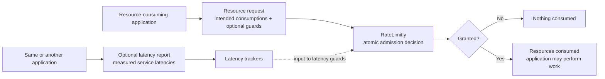

# RateLimitly Java Client

## What RateLimitly does

[RateLimitly](https://ratelimitly.com/) is a distributed admission-control
service. It decides whether an application may begin work that consumes
configured resources. A decision may also depend on whether recently observed
service latencies remain below application-defined thresholds.

`rl-java-client` is the framework-independent Java library through which an
application requests those decisions and, independently, contributes latency
measurements used by future decisions.

## Core operations

The library exposes two independent operations:

- A **resource request** describes work the application wants to perform as
  zero or more resource consumptions and zero or more latency guards.
  RateLimitly evaluates every non-empty request atomically. A grant consumes
  every requested quantity and authorizes the application to proceed; a
  rejection consumes none. The empty request is the identity case and returns
  local success without network activity.
- A **latency report** contributes one or more measured service latencies to
  the trackers consulted by latency guards in later resource requests. It does
  not consume a resource or make an admission decision.

An application may use either operation without the other. A common workflow
is to request permission for work, perform it only after a grant, and then
optionally report measured latencies for services used by that work. A reporter
may instead send only latency reports, and a resource consumer may send only
resource requests.



## Three small examples

The examples assume that a reusable `RateLimitlyClient client` has already been
created. [Configuration](docs/configuration.md) explains client construction,
API keys, discovery, and request policies.

### Request one token

In English: “Get me one token for `checkout`, whose limit is 100 tokens per
second.”

```java
RateLimitRequest request = new RateLimitRequest(
    List.of(new ResourceRequest(
        "checkout", // bucket name
        1_000,      // one-second rate window
        100,        // tokens available per window
        1           // tokens requested now
    )),
    List.of(),      // no latency guards
    null            // no metrics label
);

try {
    RateLimitDecision decision = client.checkRateLimit(request);
    if (decision.success()) {
        performCheckout();
    } else {
        rejectCheckout();
    }
} catch (RateLimitlyException failure) {
    applyApplicationFailurePolicy(failure);
}
```

A grant consumes one token and authorizes the operation. A rejection consumes
nothing. A `RateLimitlyException` is a third outcome: the client did not obtain
a usable decision. Failure does not mean rejection, and it does not prove that
no server processed a transmitted request.

### Report one service latency

In English: “Record that one call to `inventory` took 18 ms.”

```java
client.reportLatency(new LatencyReport(List.of(
    new ServiceLatencyReport(
        "inventory", // latency-tracker name
        18,          // observed latency in milliseconds
        10_000,      // sample lifetime in milliseconds
        100,         // maximum samples considered
        5            // warm-up sample threshold
    )
)));
```

The report contributes one measurement to the `inventory` latency tracker. It
does not consume a resource and is not paired with a particular resource
request.

### Request one token with one latency guard

In English: “Get me one token for `checkout`, but only if the tracked
`inventory` latency is below 100 ms.”

```java
RateLimitRequest guardedRequest = new RateLimitRequest(
    List.of(new ResourceRequest(
        "checkout", // bucket name
        1_000,      // one-second rate window
        100,        // tokens available per window
        1           // tokens requested now
    )),
    List.of(new LatencyGuard(
        "inventory", // same tracker definition as the report
        100,         // required latency threshold in milliseconds
        10_000,      // sample lifetime in milliseconds
        100,         // maximum samples considered
        5            // warm-up sample threshold
    )),
    null              // no metrics label
);

RateLimitDecision decision = client.checkRateLimit(guardedRequest);
```

RateLimitly evaluates the resource consumption and guard as one decision. A
grant consumes the token and authorizes the work. If either condition fails,
the complete request is rejected and nothing is consumed.

## Availability

The Java client is being prepared for its first public Maven Central release.
Until that release is published, build and test it from a source checkout:

```sh
mvn -B verify
```

The library requires Java 21 or newer. `mvn verify` compiles the client, runs
the complete JUnit 5 suite, and builds a JAR with the stable automatic module
name `com.ratelimitly.client`. See the [Maven Central release
runbook](docs/releasing.md) for publication requirements and verification.

## Documentation

- [Public Java API and outcomes](docs/api.md)
- [API keys, discovery, and configuration](docs/configuration.md)
- [Resource-request HA policy](docs/request-policy.md)
- [Lifecycle, concurrency, and asynchronous calls](docs/lifecycle.md)
- [Security policy and credential handling](SECURITY.md)
- [Contributing](CONTRIBUTING.md)
- [Changelog](CHANGELOG.md)

## License

Released under the [MIT License](LICENSE).
